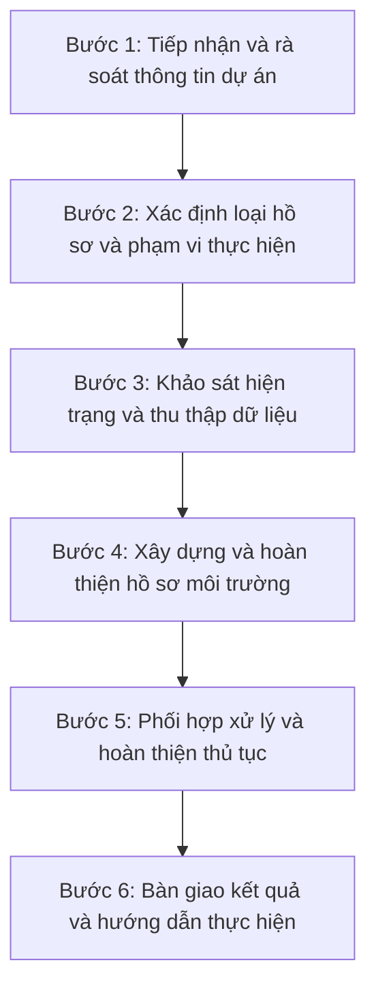

# DỊCH VỤ LÀM HỒ SƠ MÔI TRƯỜNG TRỌN GÓI CHO DOANH NGHIỆP

**Hợp Nhất** · Tư vấn hồ sơ môi trường cho doanh nghiệp
 **Hotline: 0938.857.768**

## Mục lục

- [1. Dịch vụ làm hồ sơ môi trường trọn gói là gì?](#dich-vu)
- [2. Các hồ sơ môi trường Hợp Nhất hỗ trợ](#ho-so)
- [3. Quy trình triển khai](#quy-trinh)
- [4. Lợi ích của dịch vụ trọn gói](#loi-ich)
- [5. Cam kết của Hợp Nhất](#cam-ket)
- [6. Liên hệ tư vấn](#lien-he)

## Tổng quan nhanh

| Hạng mục | Nội dung |
| --- | --- |
| **Phạm vi** | Rà soát hiện trạng → xác định thủ tục → khảo sát/thu thập dữ liệu → lập và hoàn thiện hồ sơ → hỗ trợ thủ tục → bàn giao, hướng dẫn thực hiện |
| **Nhóm hồ sơ** | ĐTM · Giấy phép môi trường · Đăng ký môi trường · Báo cáo công tác BVMT · Hồ sơ ứng phó sự cố hóa chất · Hồ sơ khai thác, sử dụng nước dưới đất/nước mặt |
| **Cách tiếp cận** | Một đầu mối triển khai xuyên suốt; đối chiếu giữa pháp lý, hoạt động sản xuất và công trình bảo vệ môi trường |
| **Đơn vị tư vấn** | Hợp Nhất |
| **Liên hệ** | Hotline **0938.857.768** · [moitruonghopnhat.com](https://moitruonghopnhat.com/) |

*Trong quá trình đầu tư và vận hành, doanh nghiệp cần bảo đảm hồ sơ môi trường được thực hiện đầy đủ, đúng thời điểm và phù hợp với hiện trạng hoạt động. **Dịch vụ làm hồ sơ môi trường trọn gói cho doanh nghiệp** của Hợp Nhất được xây dựng nhằm hỗ trợ xuyên suốt từ khâu rà soát, xác định thủ tục đến lập và hoàn thiện hồ sơ. Nhờ quy trình thống nhất này, doanh nghiệp có thể chủ động hơn về tiến độ, giảm áp lực phối hợp và duy trì sự đồng bộ giữa yêu cầu pháp lý với hoạt động thực tế.*

*Dịch vụ làm hồ sơ môi trường trọn gói cho doanh nghiệp (ảnh minh họa)*

## 1. Dịch vụ làm hồ sơ môi trường trọn gói là gì?

> Dịch vụ làm hồ sơ môi trường trọn gói là dịch vụ hỗ trợ doanh nghiệp thực hiện toàn bộ quá trình từ rà soát hiện trạng, xác định thủ tục môi trường cần thực hiện, lập hồ sơ, hoàn thiện hồ sơ đến theo dõi và hỗ trợ trong quá trình làm việc với cơ quan có thẩm quyền.

Đây là giải pháp giúp doanh nghiệp xử lý các thủ tục môi trường thông qua một đầu mối chuyên môn thống nhất, giúp giảm thời gian tự tìm hiểu thủ tục và bảo đảm các nội dung môi trường được rà soát đồng bộ với tình trạng hoạt động thực tế của dự án. Đơn vị tư vấn sẽ căn cứ vào thông tin thực tế của dự án để xác định nghĩa vụ môi trường, xây dựng phương án thực hiện và hỗ trợ doanh nghiệp trong suốt quá trình hoàn thiện hồ sơ.

Khác với việc chỉ lập một bộ hồ sơ theo yêu cầu có sẵn, dịch vụ trọn gói bắt đầu từ bước rà soát tổng thể tình trạng pháp lý và hiện trạng hoạt động của doanh nghiệp. Cách tiếp cận này giúp xác định đúng vấn đề ngay từ đầu, đồng thời hạn chế tình trạng doanh nghiệp thực hiện thiếu hồ sơ, thực hiện không đúng thời điểm hoặc phải điều chỉnh nhiều lần trong quá trình giải quyết thủ tục.

**Tùy vào từng dự án, phạm vi dịch vụ của Hợp Nhất có thể bao gồm:**

- Tiếp nhận và rà soát thông tin pháp lý của dự án hoặc cơ sở;
- Xác định loại hồ sơ môi trường cần thực hiện;
- Tư vấn danh mục tài liệu doanh nghiệp cần chuẩn bị;
- Khảo sát hiện trạng hoạt động sản xuất và công trình bảo vệ môi trường;
- Tổng hợp số liệu về nguyên liệu, công suất, nước thải, khí thải và chất thải;
- Lập, rà soát và hoàn thiện hồ sơ;
- Hỗ trợ doanh nghiệp trong quá trình thực hiện thủ tục;
- Chỉnh sửa, bổ sung và giải trình hồ sơ khi có yêu cầu;
- Tư vấn các nghĩa vụ môi trường cần tiếp tục thực hiện sau khi hoàn thành thủ tục.

> *Mục tiêu của Hợp Nhất không chỉ là hoàn thành hồ sơ mà còn giúp doanh nghiệp xây dựng được **sự thống nhất** giữa pháp lý môi trường, hoạt động sản xuất và các công trình bảo vệ môi trường. Đây là nền tảng quan trọng để doanh nghiệp chủ động hơn trong công tác quản lý môi trường trong suốt quá trình hoạt động.*

## 2. Hợp Nhất thực hiện những hồ sơ môi trường nào cho doanh nghiệp?

Tùy vào loại hình sản xuất, quy mô dự án, công suất, vị trí, nguồn phát sinh chất thải và giai đoạn hoạt động, mỗi doanh nghiệp có thể phải thực hiện một hoặc nhiều hồ sơ môi trường khác nhau. Vì vậy, Hợp Nhất không áp dụng một bộ hồ sơ chung mà sẽ rà soát từng dự án để xác định đúng thủ tục cần thực hiện, từ đó xây dựng phương án phù hợp với tình trạng thực tế của doanh nghiệp.

### 2.1. Báo cáo đánh giá tác động môi trường (ĐTM)

Báo cáo đánh giá tác động môi trường được thực hiện đối với các dự án thuộc đối tượng phải lập ĐTM theo quy định. Hồ sơ này giúp doanh nghiệp nhận diện các tác động có thể phát sinh trong quá trình xây dựng và vận hành, từ đó xác định các công trình và biện pháp bảo vệ môi trường phù hợp với quy mô, công nghệ và đặc điểm của dự án.

### 2.2. Giấy phép môi trường

[Giấy phép môi trường](https://moitruonghopnhat.com/lap-giay-phep-moi-truong-cho-doanh-nghiep-1476/) là thủ tục quan trọng đối với các dự án, cơ sở thuộc đối tượng phải được cấp phép theo quy định. Trong quá trình lập hồ sơ, doanh nghiệp cần làm rõ công suất sản xuất, các nguồn phát sinh nước thải, khí thải, chất thải, công trình xử lý và yêu cầu quan trắc để bảo đảm nội dung hồ sơ phù hợp với hiện trạng hoạt động thực tế.

*Dịch vụ lập hồ sơ giấy phép môi trường*

### 2.3. Đăng ký môi trường

Đăng ký môi trường áp dụng đối với các dự án, cơ sở thuộc trường hợp phải thực hiện theo quy định. Nội dung hồ sơ tập trung vào quy mô hoạt động, nguyên liệu sử dụng, các nguồn phát sinh chất thải và biện pháp quản lý môi trường, qua đó giúp cơ sở xác lập đầy đủ các thông tin cần thiết trong quá trình hoạt động.

### 2.4. Báo cáo công tác bảo vệ môi trường

[Báo cáo công tác bảo vệ môi trường](https://moitruonghopnhat.com/tu-van-lap-dtm-danh-gia-tac-dong-moi-truong-cho-du-an-215/) phản ánh tình hình thực hiện các yêu cầu bảo vệ môi trường của doanh nghiệp trong kỳ báo cáo. Nội dung báo cáo thường tổng hợp số liệu về nước thải, khí thải, chất thải, kết quả quan trắc và tình trạng vận hành các công trình xử lý, từ đó giúp doanh nghiệp duy trì thông tin môi trường đầy đủ và thống nhất.

### 2.5. Hồ sơ ứng phó sự cố hóa chất

[Hồ sơ ứng phó sự cố hóa chất](https://moitruonghopnhat.com/dich-vu-lap-ho-so-ung-pho-su-co-hoa-chat-theo-quy-dinh/) được thực hiện nhằm giúp doanh nghiệp chủ động phòng ngừa, kiểm soát và xử lý các tình huống sự cố có thể xảy ra trong quá trình sản xuất, lưu trữ, bảo quản và sử dụng hóa chất. Tùy theo loại hóa chất, khối lượng tồn trữ, quy mô hoạt động và đặc điểm của cơ sở, doanh nghiệp có thể phải thực hiện các thủ tục, phương án hoặc hồ sơ liên quan đến ứng phó sự cố hóa chất theo quy định. Hợp Nhất hỗ trợ rà soát hiện trạng sử dụng hóa chất, nhận diện các nguy cơ sự cố và xây dựng hồ sơ phù hợp với điều kiện thực tế của doanh nghiệp.

*Dịch vụ lập hồ sơ ứng phó sự cố hóa chất*

### 2.6. Hồ sơ khai thác, sử dụng nước ngầm và nước mặt

Doanh nghiệp có hoạt động khai thác, sử dụng nước dưới đất hoặc nước mặt cho sản xuất, kinh doanh, dịch vụ, nông nghiệp và các mục đích khác có thể phải thực hiện thủ tục đăng ký hoặc xin cấp phép theo quy mô khai thác, mục đích sử dụng và điều kiện nguồn nước. Hồ sơ cần xác định rõ vị trí công trình khai thác, nguồn nước, lưu lượng, mục đích sử dụng, thời gian khai thác và các thông tin kỹ thuật có liên quan. Hợp Nhất hỗ trợ doanh nghiệp rà soát nhu cầu khai thác thực tế, xác định thủ tục phù hợp và lập hồ sơ theo quy định hiện hành.

## 3. Quy trình làm hồ sơ môi trường trọn gói tại Hợp Nhất

Để hồ sơ được triển khai đúng hướng ngay từ đầu, Hợp Nhất xây dựng quy trình thực hiện theo từng bước rõ ràng, từ tiếp nhận thông tin đến bàn giao kết quả. Trong toàn bộ quá trình, đội ngũ chuyên môn duy trì việc đối chiếu giữa thông tin pháp lý, hoạt động sản xuất và công trình bảo vệ môi trường nhằm hạn chế những điểm không thống nhất có thể phát sinh khi hồ sơ được xem xét.

### Sơ đồ quy trình

### Bước 1: Tiếp nhận và rà soát thông tin dự án

Hợp Nhất tiếp nhận các thông tin cơ bản về dự án như ngành nghề, địa điểm, diện tích, công suất, công nghệ sản xuất, nguyên liệu sử dụng và tình trạng hoạt động. Nếu doanh nghiệp đã có các [hồ sơ môi trường](https://moitruonghopnhat.com/ho-so-moi-truong/) trước đây, đội ngũ chuyên môn sẽ tiếp nhận để rà soát đồng thời, qua đó có cái nhìn tổng thể trước khi xác định phương án triển khai.

### Bước 2: Xác định loại hồ sơ và phạm vi thực hiện

Từ thông tin ban đầu, Hợp Nhất tiến hành phân tích tính chất dự án, quy mô, nguồn phát sinh chất thải và tình trạng pháp lý hiện tại để xác định loại hồ sơ phù hợp. Bước rà soát này giúp doanh nghiệp biết rõ mình cần thực hiện thủ tục nào, phạm vi công việc ra sao và cần chuẩn bị những tài liệu gì trước khi bắt đầu.

### Bước 3: Khảo sát hiện trạng và thu thập dữ liệu

Đối với những hồ sơ cần kiểm tra thực tế, đội ngũ Hợp Nhất sẽ khảo sát tại nhà máy, cơ sở hoặc dự án. Nội dung khảo sát tập trung vào dây chuyền sản xuất, hệ thống thoát nước, nguồn phát sinh nước thải, khí thải, khu vực lưu giữ chất thải và các công trình bảo vệ môi trường đang được xây dựng hoặc vận hành.

Kết quả khảo sát là cơ sở quan trọng để đối chiếu với các tài liệu doanh nghiệp cung cấp. Nhờ đó, hồ sơ được xây dựng sát hơn với thực tế và giảm nguy cơ thông tin giữa tài liệu pháp lý và hiện trạng không đồng nhất.

### Bước 4: Xây dựng và hoàn thiện hồ sơ môi trường

Sau khi thu thập đầy đủ dữ liệu, Hợp Nhất tiến hành lập hồ sơ theo phạm vi đã xác định. Trong quá trình thực hiện, đội ngũ chuyên môn kiểm tra mối liên hệ giữa quy mô sản xuất, nguyên liệu sử dụng, nguồn phát sinh chất thải, công trình xử lý và các yêu cầu môi trường tương ứng.
Nếu phát hiện thông tin chưa thống nhất hoặc công trình thực tế chưa phù hợp với nội dung dự kiến trong hồ sơ, Hợp Nhất sẽ trao đổi với doanh nghiệp để thống nhất phương án xử lý. Cách làm này giúp hạn chế việc chỉ hoàn thiện hồ sơ về mặt hình thức nhưng thiếu tính khả thi khi áp dụng vào thực tế.

### Bước 5: Phối hợp xử lý và hoàn thiện thủ tục

Sau khi hồ sơ được hoàn thiện, Hợp Nhất tiếp tục hỗ trợ doanh nghiệp trong quá trình thực hiện thủ tục theo phạm vi dịch vụ đã thống nhất. Trường hợp phát sinh yêu cầu chỉnh sửa, bổ sung hoặc giải trình, đội ngũ phụ trách sẽ phối hợp xử lý để bảo đảm nội dung hồ sơ được cập nhật đầy đủ và nhất quán.

### Bước 6: Bàn giao kết quả và hướng dẫn thực hiện

Khi hoàn thành thủ tục, Hợp Nhất bàn giao hồ sơ và hướng dẫn doanh nghiệp các nội dung cần lưu ý trong quá trình hoạt động. Đối với những dự án tiếp tục phát sinh nghĩa vụ về quan trắc, báo cáo định kỳ, vận hành thử nghiệm hoặc quản lý công trình xử lý, doanh nghiệp có thể tiếp tục sử dụng các dịch vụ chuyên môn của Hợp Nhất để duy trì sự liên tục trong công tác môi trường.

*Quy trình làm hồ sơ môi trường trọn gói cho doanh nghiệp (ảnh minh họa)*

## 4. Lợi ích khi sử dụng dịch vụ hồ sơ môi trường trọn gói

Việc lựa chọn một đơn vị tư vấn xuyên suốt giúp doanh nghiệp kiểm soát tốt hơn tiến độ thực hiện, chất lượng hồ sơ và tính thống nhất giữa yêu cầu pháp lý với hiện trạng hoạt động. Với cách tiếp cận đồng bộ giữa pháp lý và kỹ thuật, Hợp Nhất giúp doanh nghiệp giảm khối lượng phối hợp, hạn chế các phát sinh không cần thiết và chủ động hơn trong công tác quản lý môi trường.

- **Một đầu mối - triển khai xuyên suốt:** Doanh nghiệp làm việc với một đầu mối từ khâu tiếp nhận thông tin, xác định loại hồ sơ, lập hồ sơ đến phối hợp hoàn thiện thủ tục. Cách triển khai này giúp giảm thời gian quản lý, hạn chế gián đoạn thông tin và nâng cao hiệu quả phối hợp giữa các bên.
- **Hồ sơ phù hợp với hiện trạng doanh nghiệp:** Nội dung hồ sơ được xây dựng trên cơ sở đối chiếu giữa quy mô, công suất, hoạt động sản xuất, nguồn phát sinh chất thải, công trình bảo vệ môi trường và các tài liệu pháp lý hiện có. Nhờ đó, hồ sơ có tính thống nhất cao hơn với điều kiện vận hành thực tế của doanh nghiệp.
- **Đồng bộ giữa pháp lý và kỹ thuật:** Năng lực chuyên môn trong lĩnh vực hồ sơ môi trường, xử lý nước thải, khí thải, nước cấp và vận hành hệ thống giúp Hợp Nhất xem xét đồng thời yêu cầu pháp lý và tính khả thi của giải pháp kỹ thuật. Sự đồng bộ này góp phần hạn chế chênh lệch giữa nội dung hồ sơ và công trình thực tế khi triển khai.
- **Tối ưu thời gian và nguồn lực thực hiện:** Quy trình được tổ chức theo từng bước rõ ràng, giúp doanh nghiệp chủ động kế hoạch, giảm số lần bổ sung thông tin và hạn chế khối lượng công việc nội bộ. Qua đó, doanh nghiệp có thêm điều kiện tập trung nguồn lực cho các hoạt động kinh doanh trọng tâm.

*Lợi ích khi sử dụng dịch vụ làm hồ sơ môi trường trọn gói*

## 5. Cam kết của Hợp Nhất

Hợp Nhất chú trọng tính minh bạch, nhất quán và trách nhiệm trong suốt quá trình triển khai dịch vụ. Trên cơ sở phạm vi công việc đã thống nhất, Hợp Nhất cam kết:

- Tư vấn loại hồ sơ phù hợp với đặc điểm và tình trạng thực tế của từng dự án;
- Triển khai công việc theo đúng phạm vi và tiến độ đã thống nhất;
- Rà soát thông tin hồ sơ đầy đủ, nhất quán và phù hợp với hiện trạng;
- Phối hợp giải trình, chỉnh sửa và bổ sung hồ sơ trong phạm vi dịch vụ;
- Minh bạch về phạm vi công việc, tiến độ và chi phí thực hiện;
- Đồng hành cùng doanh nghiệp đối với các nhu cầu môi trường phát sinh trong quá trình đầu tư và vận hành.

Khi hồ sơ môi trường được xây dựng bài bản và nhất quán, doanh nghiệp sẽ thuận lợi hơn trong quá trình đầu tư, vận hành và mở rộng sản xuất. Với dịch vụ làm hồ sơ môi trường trọn gói cho doanh nghiệp, Hợp Nhất kết hợp năng lực tư vấn pháp lý với kinh nghiệm kỹ thuật để bảo đảm hồ sơ có tính thực tiễn và phù hợp với từng dự án. Cách tiếp cận này giúp doanh nghiệp duy trì sự liên kết chặt chẽ giữa hồ sơ pháp lý, hoạt động sản xuất và các công trình bảo vệ môi trường.

## 6. Liên hệ tư vấn

> Quý Doanh nghiệp có nhu cầu sử dụng [dịch vụ làm hồ sơ môi trường trọn gói](https://moitruonghopnhat.com/dich-vu-lam-ho-so-moi-truong-tron-goi-cho-doanh-nghiep/), vui lòng liên hệ **Hotline: 0938.857.768** để Hợp Nhất tiếp nhận và rà soát nhu cầu thực tế. Đội ngũ chuyên môn sẽ đánh giá tình trạng hồ sơ hiện có, xác định thủ tục cần thực hiện và đề xuất lộ trình triển khai phù hợp với từng dự án.

---

### Thông tin Hợp Nhất

- **Website:** [moitruonghopnhat.com](https://moitruonghopnhat.com/)
- **Hotline:** 0938.857.768
